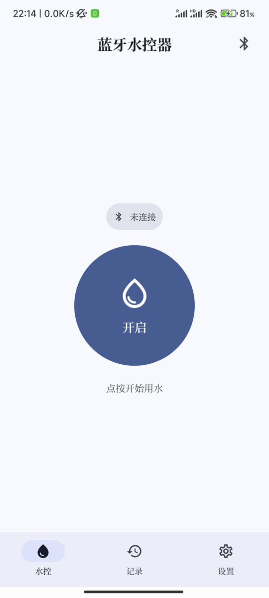
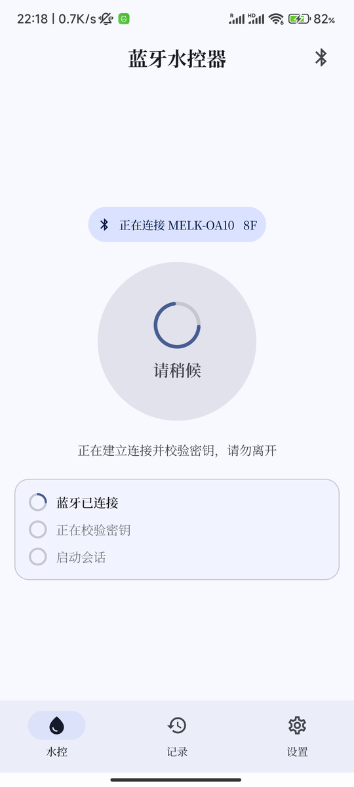
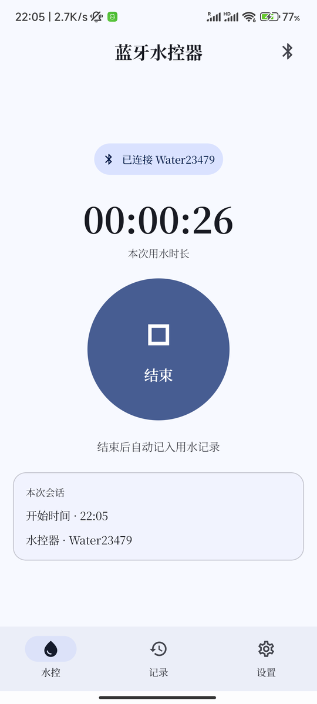
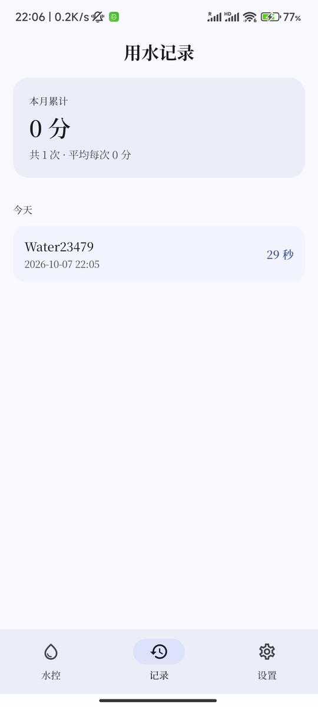
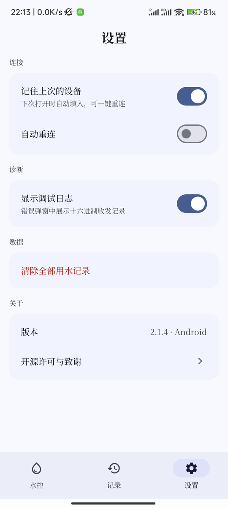
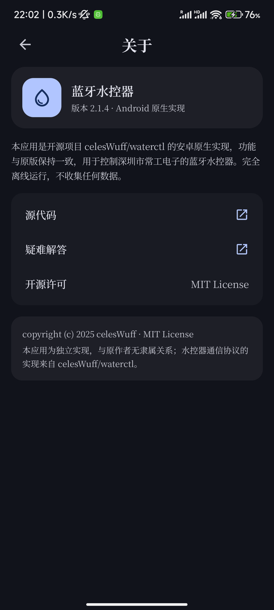
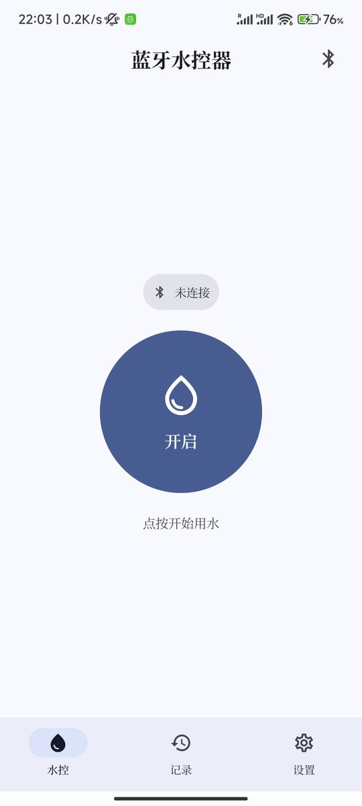
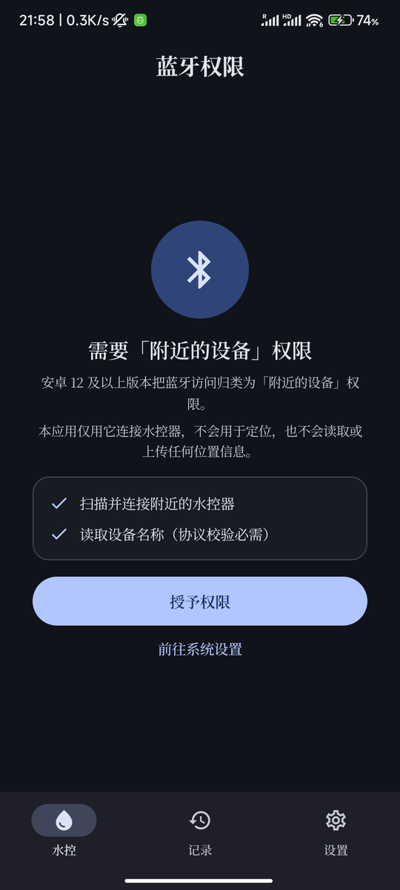

# 沐控 · AquaKey

深圳市常工电子「蓝牙水控器」的**安卓原生客户端**，Kotlin + Jetpack Compose 实现，遵循 Material 3。

> 项目代号 **AquaKey**（中文名「沐控」）。
> 应用装到手机上后显示为「**蓝牙水控器**」—— 这是个描述性名字，用户一眼就知道它是干什么的，不需要猜。

---

> ### ⚠️ 这不是原项目
>
> 本项目是 **[celesWuff/waterctl](https://github.com/celesWuff/waterctl)** 的**衍生作品**。
> 通信协议、密钥算法、报文格式、错误分类全部来自那个项目 —— 它是一个基于 Web Bluetooth 的 PWA。
>
> **如果你只是想要能用的东西，请优先使用[原项目](https://github.com/celesWuff/waterctl)。**
> 本项目只是把同样的功能用安卓原生重写了一遍，面向的是希望在安卓上有一个原生应用（而不是网页应用）的人。
>
> 原项目的版权声明按 MIT 协议要求保留在 [LICENSE](LICENSE) 中。

---

## 下载

不想自己编译的话，直接去 [**Releases**](https://github.com/bybixi/aquakey/releases/latest) 下载 APK 装到手机上就行。

- 系统要求：Android 8.0（API 26）及以上
- 体积：2.1 MB
- 首次安装需要在系统设置里允许「安装未知来源的应用」
- 每个 Release 里都附了 APK 与签名证书的 SHA-256，可自行核对

## 截图

| 主界面 | 连接中 | 使用中 | 用水记录 |
|---|---|---|---|
|  |  |  |  |

| 设置 | 关于 | 错误弹窗 | 权限引导 |
|---|---|---|---|
|  |  |  |  |

## 特性

- **与原版功能一致**：连接、开启、结束、完整的 7 类错误处理与十六进制调试日志
- **原生 Material 3**：跟随系统深浅色，Android 12+ 自动使用壁纸动态取色（Material You）
- **全局衬线字体**：思源宋体（Noto Serif SC），按源码字符集子集化到 1.5 MB
- **用水记录**：本地保存每次用水的时间与时长，按月汇总（新增功能，原版没有）
- **设备记忆**：记住上次使用的水控器，支持一键重连
- **完全离线**：不联网、不上报、无遥测（原版接了 Sentry，这里没有）
- **体积小**：release APK 约 2.2 MB

## 协议实现

本项目对原项目的协议层做了**逐行移植**，而不是"照着功能重新实现"。有两点值得说明：

### 1. 密钥算法没有引入 WebAssembly

原项目新固件的密钥认证依赖一段故意写得晦涩的 `deputy.wasm`。本项目的做法是先把
`deputy.wat` 读懂 —— 它**不是混淆虚拟机，只是一个直白的查表函数**（数据段是 2096 字节的
S 盒）—— 然后逐行翻译成 Kotlin（`core/protocol/Deputy.kt`，查找表以十六进制串内联）。

这样 APK 里不需要 WebAssembly 运行时，行为却与原版逐位一致。

### 2. 用原项目自己的测试向量锁定正确性

移植版本的正确性不是靠"看起来对"，而是拿原项目 `solvers.spec.ts` 与 `algorithms.spec.ts`
里的端到端向量来验证：

| 测试 | 向量数 | 说明 |
|---|---|---|
| `makeKey` | 6 | 从原版 `makeUnlockResponse` 的期望输出反推出原始密钥 |
| `makeUnlockResponse` | 7 | 逐字节比对，含 `nonce = 0xFFFF` 回绕特例 |
| `crc16changgong` | 5 | |
| `crc16cgaeaf` | 4 | |
| `makeStartEpilogue` | 2 | 老固件 / 新固件两条分支 |

```bash
./gradlew :app:testDebugUnitTest
```

### 3. 移植过程中保留的固件怪癖

- 固件偶尔会**漏发前 1~2 个字节**，需要补回 `FD FD 09`
- 固件偶尔会**主动发一条 AT 命令**，需要忽略
- `B0/B1` 之后要**延迟 500 ms** 再发启动帧，但新固件会在这 500 ms 内发来 `AE`，必须能取消
- `b == 0xFF && a 为奇数` 时 `a` 需要 `+2`，且 `a == 257` 要回绕成 `0`

这些在原版里都有，本移植版逐条对应，不做"优化"。

## 构建

需要 JDK 17、Android SDK（compileSdk 35）。

```bash
# 编辑 local.properties，指向你的 Android SDK
echo 'sdk.dir=/path/to/Android/Sdk' > local.properties

# 无签名构建（仅本地调试）
./gradlew :app:assembleDebug

# 跑协议层测试
./gradlew :app:testDebugUnitTest
```

### 签名

签名材料不入库。要出可安装的 release 包，先生成一份自己的密钥库：

```bash
mkdir -p keystore
keytool -genkeypair -v -keystore keystore/waterctl.jks \
  -alias waterctl -keyalg RSA -keysize 2048 -validity 10000 \
  -storepass <你的密码> -keypass <你的密码> \
  -dname "CN=Your Name, O=Your Org, C=CN"
```

然后写 `keystore/keystore.properties`：

```properties
storeFile=keystore/waterctl.jks
storePassword=<你的密码>
keyAlias=waterctl
keyPassword=<你的密码>
```

`./gradlew :app:assembleRelease` —— 找不到这份配置时会自动退化为未签名构建。

## 技术栈

| | |
|---|---|
| 语言 / UI | Kotlin 2.0.21 · Jetpack Compose（BOM 2024.10.01）· Material 3 |
| 构建 | AGP 8.7.3 · Gradle 8.9 · compileSdk 35 · minSdk 26 |
| 数据 | Room（用水记录）· DataStore（设置） |
| 导航 | Navigation Compose |
| 蓝牙 | 原生 `BluetoothGatt`（服务 `0xF1F0`，写 `0xF1F1`，通知 `0xF1F2`） |

## 已知限制

- 蓝牙设备选择面板不在原设计稿中 —— 原版靠浏览器的设备选择器，原生端必须有个等价物
- 自动重连默认关闭（设置里可开启）
- 仅测试过小米 12S / Android 13 / MIUI 14，其它机型可能有蓝牙兼容性问题
- 开发者选项里的「通过 USB 安装」若未开启，MIUI 首次 `adb install` 会报 `INSTALL_FAILED_USER_RESTRICTED`，重试一次即可

## 致谢

本项目能存在，完全是因为 [celesWuff/waterctl](https://github.com/celesWuff/waterctl)
把整套协议逆向并开源了出来 —— 包括那段晦涩但精巧的密钥算法。请给原项目一个 star。
本项目能被创作出来并上架，完全感谢我家亲爱的大肥鱼，这个项目几乎全权让它负责，甚至Readme也是（这句话不是），看着这些很像人话的Readme，让我明白了，**我们家大肥鱼也不是吃白饭的！！！**


## 许可

[MIT](LICENSE) · Copyright (c) 2021-2024 celesWuff, Deputy · Copyright (c) 2026 bybixi
